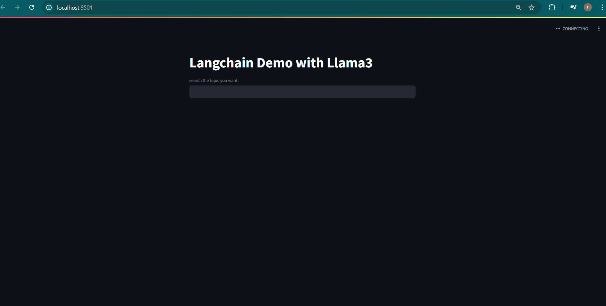

# Langchain Demo with Llama3

## Overview

This project is a Chatbot powered by Large Language Models (LLM) and Llama3. It allows users to ask questions related to any terms and receive accurate responses. The chatbot utilizes a Llama3 model by meta to enhance its performance.

## Technologies Used

- Large Language Models (LLM)
- Groq API
- Llama3 Model
- Python
